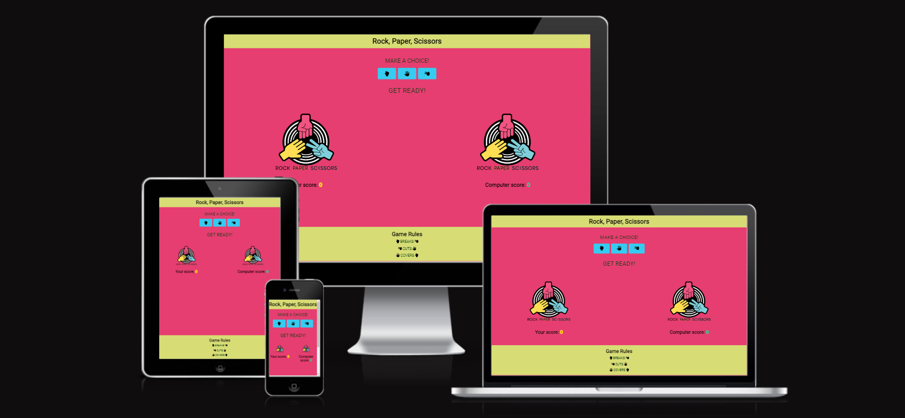
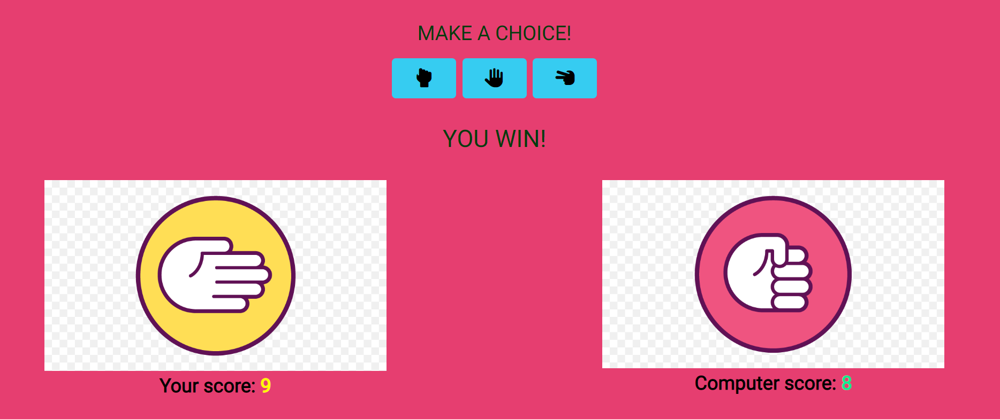
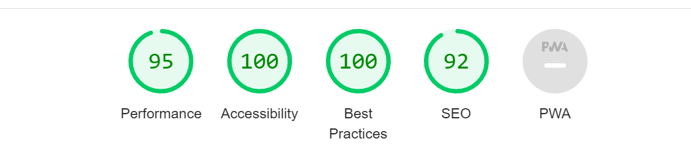
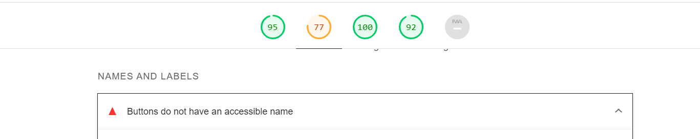
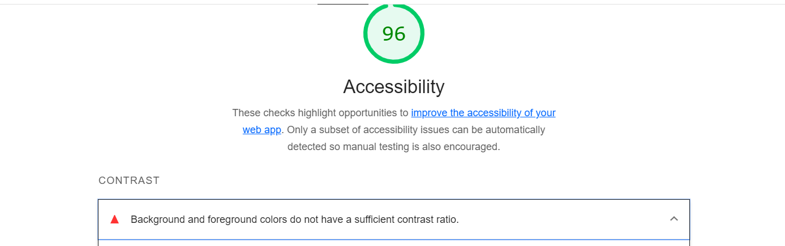

# Rock Paper Scissors Game

Welcome! [ROCK PAPER SCISSORS](https://shankar2311.github.io/Rock-Paper-Scissor/)

A classic two-person game. Players start each round by saying, “rock, paper, scissors, shoot!” On “shoot,” each player holds out their fist for rock, flat hand for paper, or their index and middle finger for scissors. Rock crushes scissors, scissors cut paper, and paper covers rock. As the computer player in Rock Paper Scissors choose randomly, the results of the game give a fairer result that playing with ones hands.

Users of this game will learn the rules of Rock Paper Scissors so they can apply it to decision making with others in their lives. This site will be targeted towards children and adults alike as a simple app to learn, practice and have fun with.

## Features

### Existing Features

- ***Header***
    - Featured at the top of the page, the header shows the game name: Rock Paper Scissors in a font that is playful and clearly contrasts with the background.
    - This header clearly tells the user what game they are playing.

    

- ***The Game Options***
    - The Game options include a clear instructions and then a choice of options to choose from to play: Rock, Paper, Scissors. These options are interactive buttons that the user can click to make their choice.
    - This section provides interactive buttons that the user can click to make their choice and play the game.

     

- ***The Game Results***
     - When the user clicks an option, the image relating to their choice is shown on their side of the game board.
     - The JavaScript code chooses a random option for the computer player, displays the image relating to the computer's choice, and then determines who the winner is.
     - The winner is announced to the user under the options button, and the score is updated for either the user or the computer, depending on who won.
     - The results and score are clear to the player, making the game easy to paly, understand who won, and what the score is.

     

- ***The Footer***
    
    - The footer section shows the rules of Rock Paper Scissors Game.
    - The footer is valuable to the user because it clearly explains how the game is played.

     

 - ***Testing and Lighthouse report***

    - The site works well on different browsers like Chrome, Firefox and Microsoft Edge.

    - Shown good results while testing responsiveness to different screens size.
 
     

 - ***Validator Testing***
    - HTML
        - No errors were found when passing through the official W3C validator.
    - CSS
        - No errors were found when passing through the official CSS Jigsaw validator.

- ***Bugs***

    - The buttons do not have an accessible name.
    

    - Background and Foreground colors do not have a sufficient contrast ratio.
    

- ***Solved Bugs***

    - The buttons do not have an accessible name solved by adding Aria-label to buttons.
    
    - Background and Foreground colors do not have a sufficient contrast ratio solved by changing the color for better visibility.

    

 - ***Deployment***

    - The process to deploy the project to Github Pages are as follows:

1. Log in to GitHub.com

2. Select the GitHub repository and navigate to the settings.

3. Find the Pages tab and click on it.

4. From the source drop-down menu, select the "Deploy from a branch".

5. And from the Branch menu, select the "main".

6. Click the "save" button, the page will be automatically refreshed.

7. A live link will be dispalyed on top of the page.

## Credits

- ***Content and code***

    - The Basic idea of HTML structure is inspired from Code Institutes Rock Paper Scissors project.

    - The Js code was Influenced and inspired from Code Institutes Rock Paper Scissors project and Js essentials lessions. 

    - Layout structure of the main page was influenced from Rock Paper Scissors project by Code Institute. 

    - README.md file was taken from the Code Institute readme-template.

    - The Fonts were taken from [Google Fonts](https://fonts.google.com/)

- ***Media***

    - Images are taken from [google](https://www.google.com/)

    - The icons in the footer were taken from [Font Awesome](https://fontawesome.com/)

- ***Acknowledgement***

    - Very Thankfull to Code Institute Slack Community.